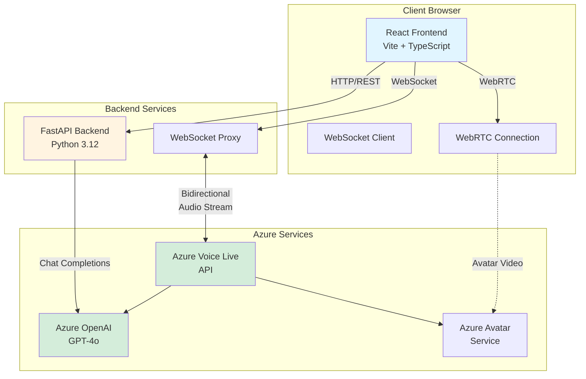
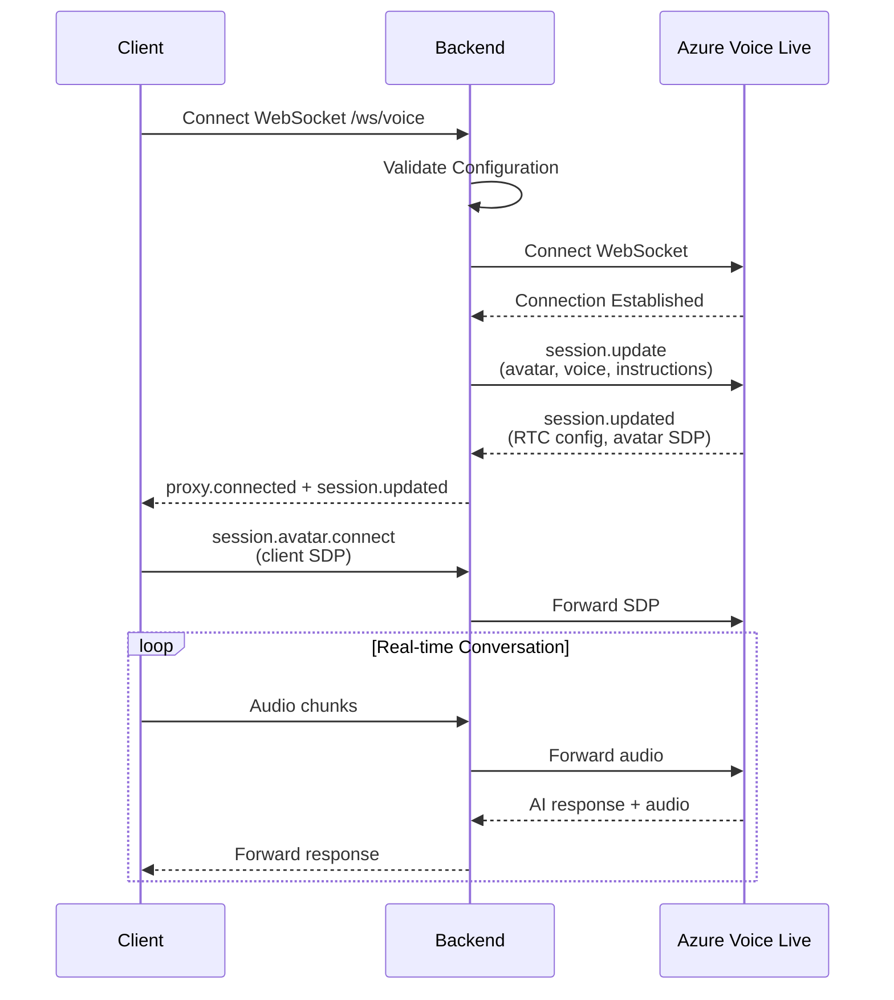

# Frontier AI Solutions

> [!NOTE]
> See it live at [frontierai.solutions](https://frontierai.solutions)
> Learn more about the implementation at [deepwiki](https://deepwiki.com/microsoft/frontierai.solutions)

An interactive experience that helps customers discover how frontier AI capabilities solve their specific business challenges. Built for experience centers, innovation hubs, demo booths, and partner demonstrations where customers need to quickly understand how cutting-edge solutions map to their roles, KPIs, and business outcomes.

**What makes this different:** Traditional solution catalogs overwhelm customers with features. This experience guides customers through conversational discovery—whether they're exploring by role, function, or business challenge—and connects them to the right solutions with personalized context.

### Key Capabilities

- **Conversational Discovery** - Natural voice and text interaction with an AI avatar (Aria) that understands business context
- **Role-Based Exploration** - Navigate solutions by job function, industry vertical, or business scenario
- **Outcome Mapping** - See how frontier capabilities connect to specific KPIs and success metrics
- **Experience Center Ready** - Designed for in-person demonstrations in showrooms, partner events, and customer visits
- **Extensible & Self-Hostable** - Fork and customize for your offerings, brand, and partner ecosystem

**Powered by Azure AI Foundry:** Real-time voice, intelligent avatar, and Azure OpenAI for contextual understanding.

## Quick Start (Local)

**Backend:**
```bash
cd backend
cp .env.example .env
# Edit .env with your Azure credentials
uv sync
uv run fastapi dev app/main.py
```

**Frontend:**
```bash
cd frontend
cp .env.example .env
pnpm install
pnpm run dev
```

Open http://localhost:5173

## Deploy to Azure

```bash
azd auth login
azd up
```

The deployment outputs will include your app URLs.

## Architecture

### System Overview



### Voice WebSocket Flow



## Documentation

- **[Backend README](backend/README.md)** - API endpoints, configuration, WebSocket protocol
- **[Frontend README](frontend/README.md)** - Component structure, hooks, deployment

## License

MIT